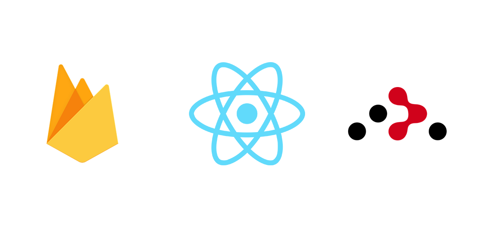

# React Blog App Template
<p align="center">
   
</p>

Template for blog apps.

## Used Tools
- Node.js
- React.js
- React Redux
- React Router v6
### Database
- Firebase

## Quick Installation
```
npm install
```

## Run Project
```
npm start
```

## Features
- Login with Google authentication.
- Private and public routing.
- Listing only their own blogs for authors.
- Blog create, update, delete.
- Blog detail listing.

## License
MIT
